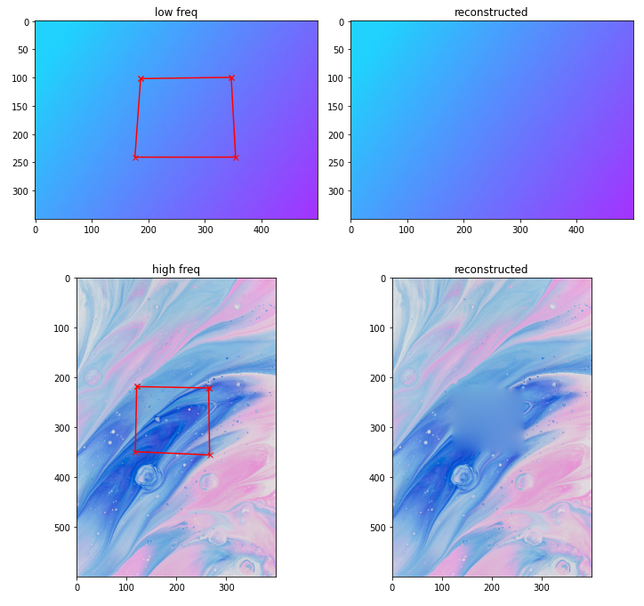
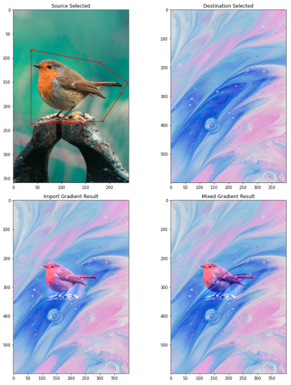
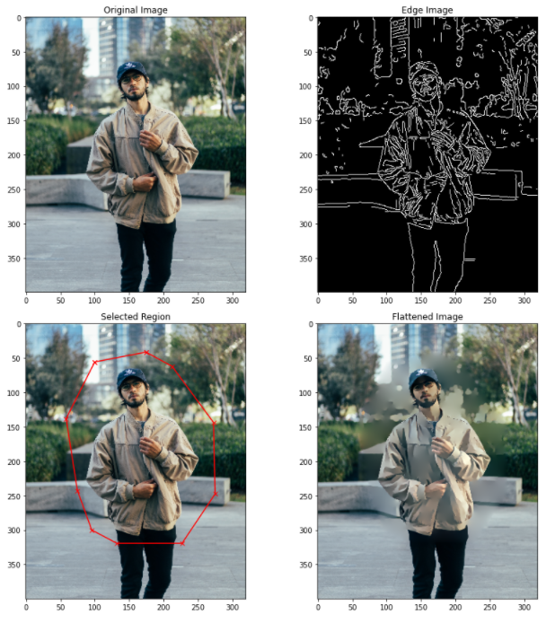
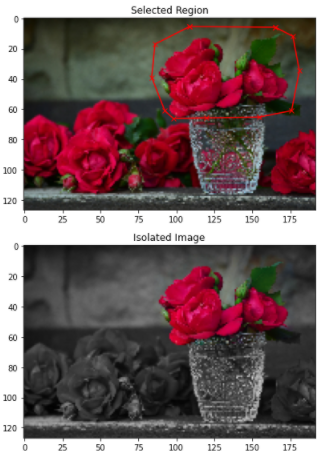
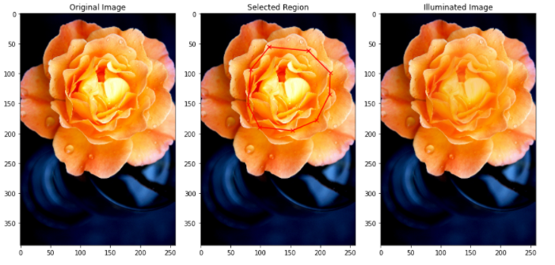
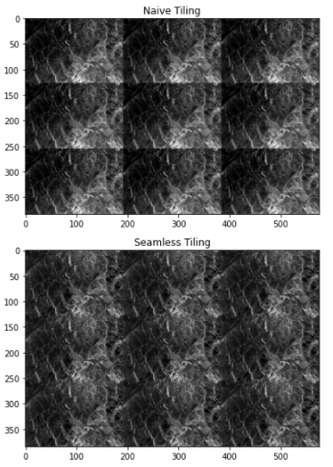

# Poisson Image Editing
> Python Implementation of the poisson image editing paper: https://www.cs.jhu.edu/~misha/Fall07/Papers/Perez03.pdf 
> ucl comp0026 image processing coursework

### Naive Filling

### Import & Mixing Gradient (Seamless Cloning)

### Texture Flattening

### Color Isolation

### Illumination

### Seamless Tiling

